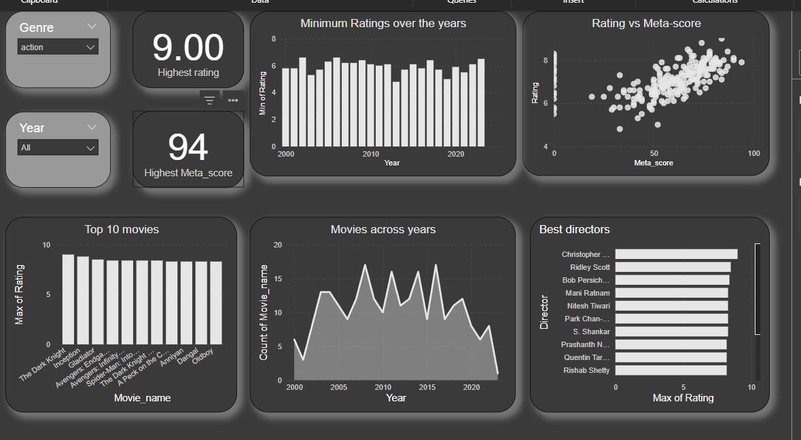

# Movie Genre Analysis Dashboard

## Problem Statement

This project aims to analyze movie genres over the years to understand audience preferences and trends in the film industry. By exploring key metrics such as IMDb ratings, Meta scores, and release years, we aim to uncover valuable insights about the evolving tastes of moviegoers.

---

## Project Overview

### Objective

This project focuses on analyzing movie data to:

- Identify trends in audience preferences for genres over the years.
- Evaluate the correlation between IMDb ratings and Meta scores.
- Highlight top-performing directors and movies based on ratings.

### Tools Used

- **Python**: For data scraping, preprocessing, and cleaning.
- **Power BI**: For creating an interactive and insightful dashboard.

### Data Source

The dataset was scraped from a publicly available movie database called IMDB using Python libraries like selenium.

---

## Dashboard Preview

## Features of the Dashboard

The Power BI dashboard includes the following visualizations:

1. **Filters**:

   - **Genre Filter**: Enables users to explore data for specific genres.
   - **Year Filter**: Allows filtering movies by release year.

2. **Key Metrics**:

   - Highest IMDb rating for the selected genre.
   - Highest Meta score for the selected genre.

3. **Visualizations**:

   - **Minimum Ratings Over the Years**: Shows how the lowest ratings have trended over time.
   - **Rating vs. Meta Score**: A scatter plot to analyze the correlation between IMDb ratings and Meta scores.
   - **Top 10 Movies**: Displays the highest-rated movies.
   - **Movies Released Over Time**: A line chart showing the number of movies released annually.
   - **Best Directors**: Highlights directors with the highest-rated movies.

---

## Steps to Reproduce

### 1. Data Scraping

The data was scraped using Python from IMDB website. The key steps include:

- Fetching movie details like name, rating, duration, release year, genre, director, and Meta score.
- Storing the data in a CSV file for further analysis.

### 2. Data Preprocessing

The preprocessing script (provided in the `preprocessing.ipynb` notebook) includes:

- Cleaning and transforming the data for consistency.
- Handling missing values and converting data types.

### 3. Dashboard Creation

- The cleaned data was imported into Power BI.
- Visualizations were created to address the problem statement.
- Filters and slicers were added to enhance interactivity.

---

## Insights from the Dashboard

- **Genre Preferences**: Audience preferences for genres have evolved over the years, with some genres becoming more popular than others.
- **Top Directors**: Directors like Christopher Nolan and Quentin Tarantino consistently produce highly-rated movies.
- **Correlation Between Ratings**: Meta scores and IMDb ratings show a positive correlation, indicating that critically acclaimed movies often have higher audience ratings.
- **Production Trends**: The number of movies released each year shows varying trends, reflecting industry growth and shifts in production focus.

---
---

## Acknowledgments

- Movie data was sourced from a publicly available database.
- Python libraries such as `pandas`, `numpy`, and `matplotlib` were used for data manipulation.
- Special thanks to the Power BI community for resources and inspiration.

---

## Contact

For questions or collaboration, please reach out at [rg15112001@gmail.com].

